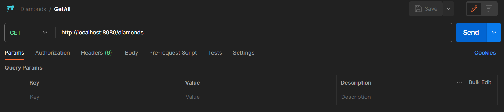
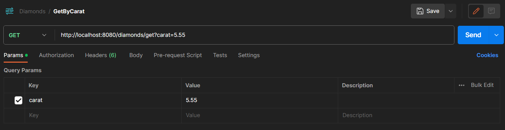
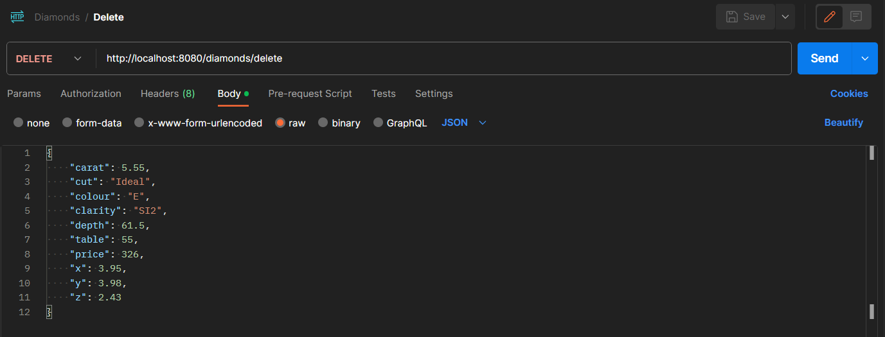

# RESTful service Diamonds

## Introduction
This is a simple RESTful project that you can use to study the principle of operation of the technologies used.

### Why I made this project
I made this project to learn and use new technologies using the Spring framework. If you are also studying it and you are interested in the technologies used in this project,you can take it as a basis and I will help you understand how everything is arranged here.

### What was used in this project
Technologies used in this project:
 - Spring Boot
 - Spring Web
 - Spring Data JDBC (DAO classes)
 - PostgreSQL database
 - Lombok
 - JUnit5 (for tests)
 - H2 database (for tests)

# How to Install and Run the project

1. You need a database to work with. In my project i used **Postgres** database, but you can use any, just dont forget to change **spring.datasource.url** in project.
2. Install Maven on your local machine, you can watch [this video](https://www.youtube.com/watch?v=km3tLti4TCM).
3. Clone this github repository to your local machine.
4. Open the project and let Maven download all dependencies.
5. After first application startup you should see new table **diamonds** in your database.

# How to Use the project

Now, when the application is running, you can send different url requests to operate with with your database.

For interaction with database Postman was choosen. Here we can see the execution of all implemented queries:

 1. Add new diamond:
    
    Post method

 3. Get all diamonds:
    
    Get method
    
 5. Get diamonds by carat:
    
    Get method
    
 7. Remove diamond:
    
    Delete method

to add:
 - correct translation
 - Postman
 - how to add kaggle data
 - ending
    
Data was taken from "https://www.kaggle.com/datasets/joebeachcapital/diamonds/data".
