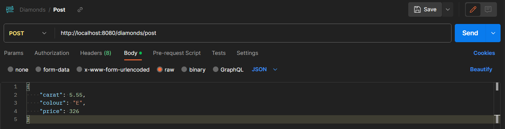
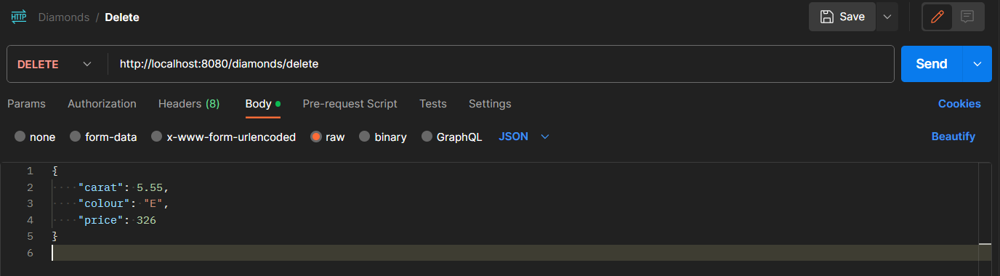

# RESTful Web Service Diamonds

## Introduction

> This is a straightforward RESTful project designed for studying the operational principles of the utilized technologies.

### Why I created this project

I developed this project to explore and apply new technologies within the Spring framework. If you are also learning and are interested in the technologies used in this project, you can use it as a foundation, and I'll assist you in understanding how everything is structured.

### Technologies used in this project

 - Spring Boot
 - Spring Web
 - Spring Data JDBC (DAO classes)
 - PostgreSQL database
 - Lombok
 - JUnit5 (for tests)
 - H2 database (for tests)

## How to Install and Run the Project

1. You need a database to work with. I used **Postgres** database, but you can use any; just dont forget to modify **spring.datasource.url** in the project.
2. Install Maven on your local machine; you can watch [this video](https://www.youtube.com/watch?v=km3tLti4TCM).
3. Clone this GitHub repository to your local machine.
4. Open the project and let Maven download all dependencies.
5. After first application startup, you should see a new table named **diamonds** in your database.
6. For convenient interaction with the program, I recommend [downloading Postman](https://www.postman.com/downloads/).

## Theory

### What is an API?

An API, or application programming interface, is a set of defined rules that enable different applications to communicate with each other. It serves as an interface for interacting with the program. For example, your program stores certain information. How can you or other applications interact with this information? An API is the answer to these questions. In our case, the API consists of URL requests like GET, POST, PUT, and DELETE.

### What are a GET POST PUT and DELETE?

GET, POST, PUT, and DELETE are methods to work with data. When you need to manage some data, you have to use the CRUD principle - Create, Read, Update, and Delete operations. With all of these, you can easily manage your data.

### What is a REST API?

It is a specific API architecture.

## How to Use the project

Now that the application is running, you can send various URL requests to operate with your database.

For interaction with the database, Postman was chosen. If you don't know what it is, here is an explanation - When working with a web service, you need to use URL links to interact with it. But often these links can be complex and not convenient. This is where Postman comes in, allowing you to easily and conveniently create both ordinary and complex requests.

Here we can see the execution of all implemented queries:

### Post method
  Using the POST method we can add new objects to database. In our implementation we only have to provide URL with POST method and RequestBody in JSON format (in our case it`s object of Diamond class).
  
  
  
    
### Get method
  Using the GET method we can get the list of objects from database. In our implementation we only have to provide URL with GET method.
  
  

  Result - list of objects in JSON format:                                                                     
  
  
  
    
### Get method
  This is another GET method, using which you can obtain list of objects by selected parameter(in our case this parameter is carat).
  
  

  Result - list of objects in JSON format:                                                                
  
  
  
    
### Delete method
  Using the DELETE method we can delete objects from database. In out implementation we need to provide URL with DELETE method and RequestBody in JSON format (Diamond that we want to delete)
  
  

## Tests

You can also find implemented tests in the project. They work with in-memory database H2, so they will not affect the working database.

## Conclusion

I know that project and my explanations are not great, but it is one of my first Spring Boot application where i knew what i was doing, and this is the first README file that i made so detailed. Maybe you can find here something useful, but i dont actually recommend spend a lot of time on this project because it has a lot of disadvantages, like:
 - Implementing DAO classes instead of using Hibernate with Spring Data Jpa
 - A rather sparse database schema with no relationships
 - ...

Thanks for your interest in my project, I hope you found something interesting or even useful here! Also check out my other repositories, I'm going to describe all my next projects like this one, maybe you`ll find something interesting there!
